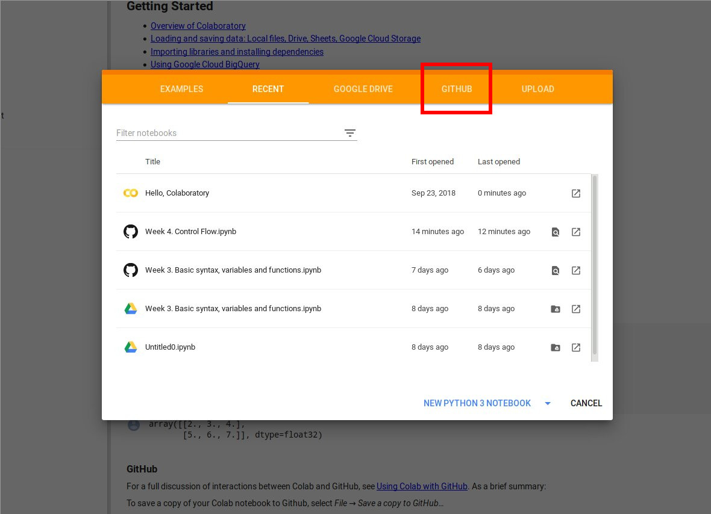
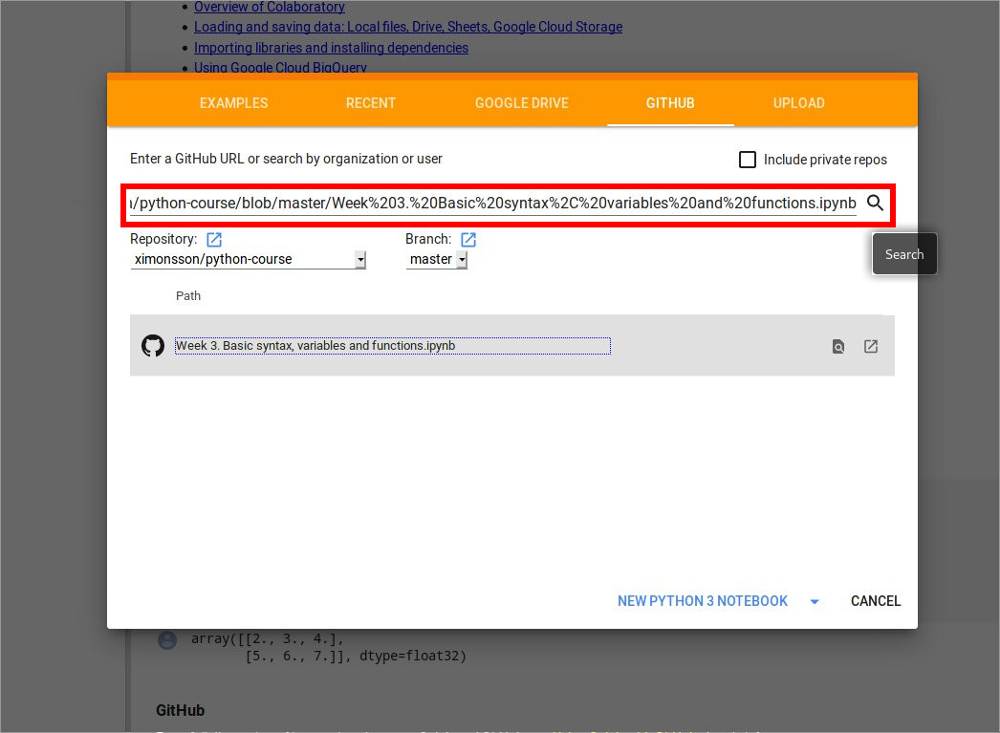

# python-course

Here you will find all the notebooks and material for the course.

## Planning

 * week 3: Basic syntax, variables and functions.
 * week 4: Control flow.
 * week 5: Input/Output, modules, files, command line.
 * week 6: Lists, dictionaries, sets.
 * week 7: ...
 * ...

## How to open the notebooks

### Host yourself

You are very welcome to clone this repository and install your Jupyter Notebook server to host the notebooks.

Instructions can be found at the [Jupyter Notebook homepage](https://jupyter.org/install).

During a later class I will demonstrate how to install it otherwise.

### Through Google Colab

Host a Jupyter server yourself may feel too advanced at first, and in that case Google offers a free hosting of the notebooks for you through their [Colab project](https://colab.research.google.com).

 * Go to the above link. You will be prompted with a dialog window that will ask you to open a notebook. Click on the github tab.
   

 * Copy the URL to the notebook from the github repository and insert into the search field and search. There should come up a result with the notebook that you can click on to open.
   
